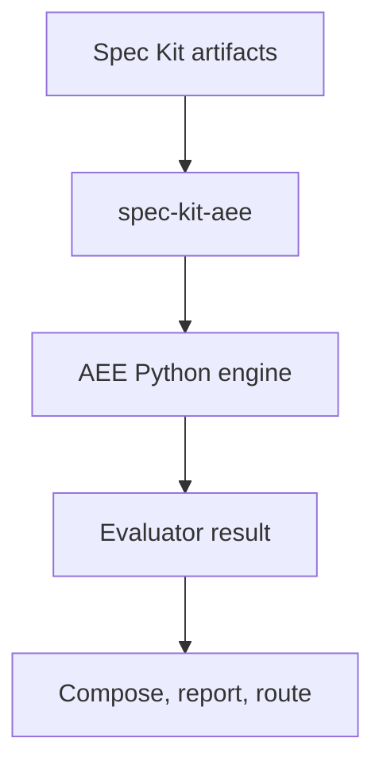

# Spec Kit integration

The Python package owns epistemic analysis. The
[`spec-kit-aee`](https://github.com/electrohire/spec-kit-aee) extension owns Spec Kit artifact
discovery, lifecycle hooks, and command UX. The
[`spec-kit-evaluator`](https://github.com/electrohire/spec-kit-evaluator) extension owns the shared
result envelope, composition, reports, and routing.

An AEE assessment is converted with `EvaluatorAdapter`. Rich claim and score data are preserved
inside the evaluator contract's opaque `state.aee` field, while actionable failures become normal
Evaluator Contract findings.

This keeps AEE opinionated and independently versioned without forking or weakening the neutral
Evaluator Contract.

